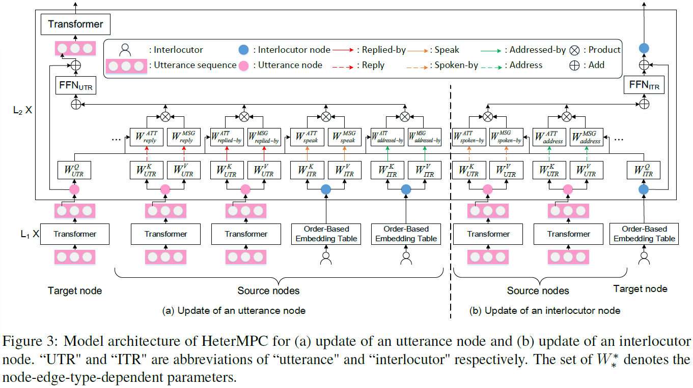
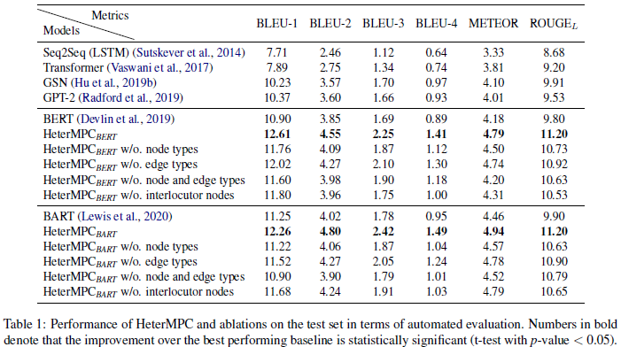

# HeterMPC: A Heterogeneous Graph Neural Network for Response Generation in Multi-Party Conversations
This repository contains the source code for the _ACL 2022_ paper [HeterMPC: A Heterogeneous Graph Neural Network for Response Generation in Multi-Party Conversations](https://arxiv.org/pdf/2203.08500.pdf). Jia-Chen Gu, Chao-Hong Tan, Chongyang Tao, Zhen-Hua Ling, Huang Hu, Xiubo Geng, Daxin Jiang.  
Hopefully, code will be released at the beginning of May. Thanks for your patience.  

## Introduction
Recently, various response generation models for two-party conversations have achieved impressive improvements, but less effort has been paid to multi-party conversations (MPCs) which are more practical and complicated. 
Compared with a two-party conversation where a dialogue context is a sequence of utterances, building a response generation model for MPCs is more challenging, since there exist complicated context structures and the generated responses heavily rely on both interlocutors (i.e., speaker and addressee) and history utterances. 
To address these challenges, we present HeterMPC, a heterogeneous graph-based neural network for response generation in MPCs which models the semantics of utterances and interlocutors simultaneously with two types of nodes in a graph. 
Besides, we also design six types of meta relations with node-edge-type-dependent parameters to characterize the heterogeneous interactions within the graph. 
Through multi-hop updating, HeterMPC can adequately utilize the structural knowledge of conversations for response generation. 
Experimental results on the Ubuntu Internet Relay Chat (IRC) channel benchmark show that HeterMPC outperforms various baseline models for response generation in MPCs.

## Update
Please keep an eye on this repository if you are interested in our work.
Feel free to contact us ({gujc,chtan}@mail.ustc.edu.cn) or open issues.
