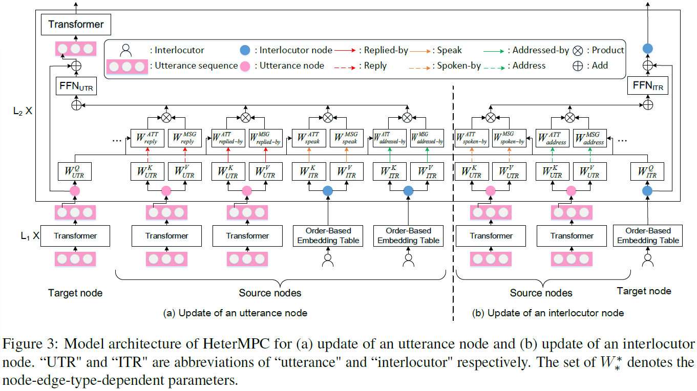
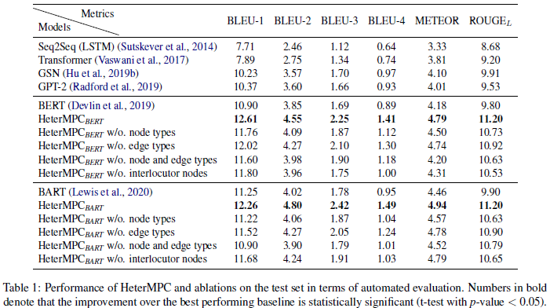
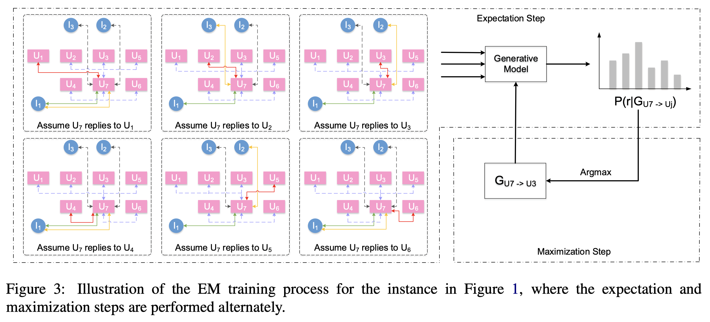
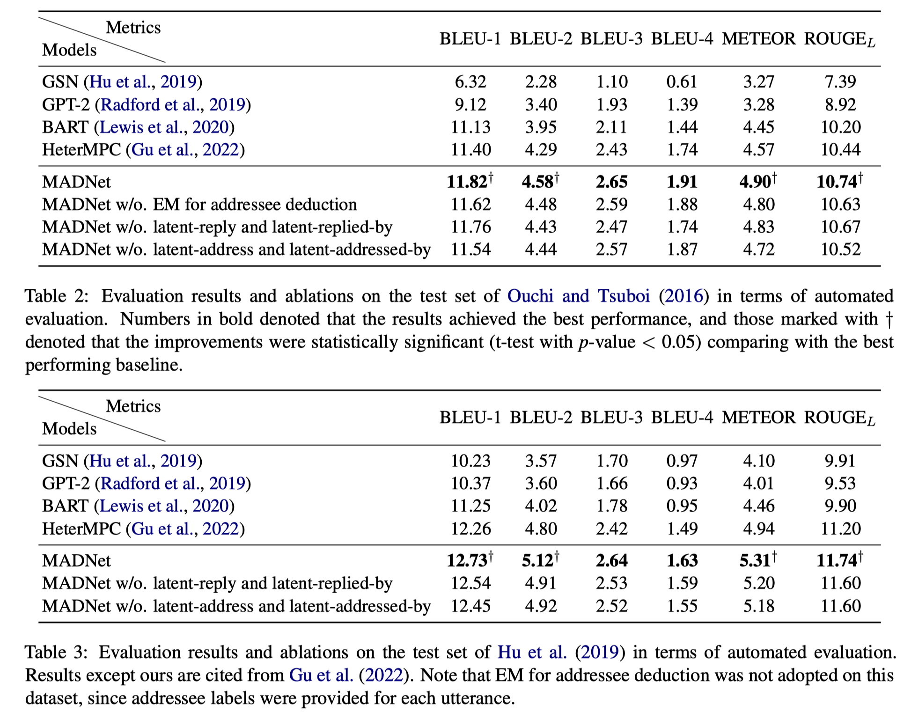

# HeterMPC & MADNet for Response Generation in Multi-Party Conversations
This repository contains the source codes for the following papers:

- [MADNet: Maximizing Addressee Deduction Expectation for Multi-Party Conversation Generation](https://arxiv.org/pdf/2305.12733.pdf). <br>
  Jia-Chen Gu<sup>\*</sup>, Chao-Hong Tan<sup>\*</sup>, Caiyuan Chu, Zhen-Hua Ling, Chongyang Tao, Quan Liu, Cong Liu <br>
  _EMNLP 2023_ <br>
  
- [HeterMPC: A Heterogeneous Graph Neural Network for Response Generation in Multi-Party Conversations](https://arxiv.org/pdf/2203.08500.pdf). <br>
  Jia-Chen Gu<sup>\*</sup>, Chao-Hong Tan<sup>\*</sup>, Chongyang Tao, Zhen-Hua Ling, Huang Hu, Xiubo Geng, Daxin Jiang. <br>
  _ACL 2022_ <br>


## Introduction for HeterMPC
Recently, various response generation models for two-party conversations have achieved impressive improvements, but less effort has been paid to multi-party conversations (MPCs) which are more practical and complicated. 
Compared with a two-party conversation where a dialogue context is a sequence of utterances, building a response generation model for MPCs is more challenging, since there exist complicated context structures and the generated responses heavily rely on both interlocutors (i.e., speaker and addressee) and history utterances. 
To address these challenges, we present HeterMPC, a heterogeneous graph-based neural network for response generation in MPCs which models the semantics of utterances and interlocutors simultaneously with two types of nodes in a graph. 
Besides, we also design six types of meta relations with node-edge-type-dependent parameters to characterize the heterogeneous interactions within the graph. 
Through multi-hop updating, HeterMPC can adequately utilize the structural knowledge of conversations for response generation. 
Experimental results on the Ubuntu Internet Relay Chat (IRC) channel benchmark show that HeterMPC outperforms various baseline models for response generation in MPCs.

<div align=center></div>

<div align=center></div>

## Introduction for MADNet
Modeling multi-party conversations (MPCs) with graph neural networks has been proven effective at capturing complicated and graphical information flows. However, existing methods rely heavily on the necessary addressee labels and can only be applied to an ideal setting where each utterance must be tagged with an “@” or other equivalent addressee label. To study the scarcity of addressee labels which is a common issue in MPCs, we propose MADNet that maximizes addressee deduction expectation in heterogeneous graph neural networks for MPC generation. Given an MPC with a few addressee labels missing, existing methods fail to build a consecutively connected conversation graph, but only a few separate conversation fragments instead. To ensure message passing between these conversation fragments, four additional types of latent edges are designed to complete a fully-connected graph. Besides, to optimize the edge-type-dependent message passing for those utterances without addressee labels, an Expectation-Maximization-based method that iteratively generates silver addressee labels (E step), and optimizes the quality of generated responses (M step), is designed. Experimental results on two Ubuntu IRC channel benchmarks show that MADNet outperforms various baseline models on the task of MPC generation, especially under the more common and challenging setting where part of addressee labels are missing.

<div align=center></div>

<div align=center></div>

## Python environment

The requirements package is in `requirements.txt`.

If you are using nvidia's GPU and CUDA version supports 11.3, you can use the following code to create the desired virtual python environment:

```shell
conda create -n heterMPC python=3.8
conda activate heterMPC
conda install pytorch==1.12.1 cudatoolkit=11.3 -c pytorch
conda install dgl-cuda11.3=0.9.1 -c dglteam 
pip install -r requirements.txt
```

You also need to patch the `transformers` package refer to `patch.txt`.
> If something goes wrong, you can also refer to the `heterMPC.yaml` file to get the package.

## Instruction

If you would like to use the evaluation tools, please clone the code with submodules.

```shell
git clone https://github.com/lxchtan/HeterMPC --recurse-submodules
```

First, unpack data files:

```shell
cd data
tar -zxvf ubuntu_data.tar.gz
```

Please refer to the shell file under the `run_shell` folder.

## Evaluation

We use the [coco-caption](https://github.com/tylin/coco-caption) to evaluate the generation results.

First, prepare the running environment. Please refer to `analyse/coco-caption`.

Then, you can run the script, `analyse/cal_coco.sh` to get the evaluation results.

```bash
bash analyse/cal_coco.sh
```

## Cite

If you think our work is helpful or use the code, please cite the following papers:
**"MADNet: Maximizing Addressee Deduction Expectation for Multi-Party Conversation Generation"**
Jia-Chen Gu, Chao-Hong Tan, Caiyuan Chu, Zhen-Hua Ling, Chongyang Tao, Quan Liu, Cong Liu. _EMNLP (2023)_
**"HeterMPC: A Heterogeneous Graph Neural Network for Response Generation in Multi-Party Conversations"**
Jia-Chen Gu, Chao-Hong Tan, Chongyang Tao, Zhen-Hua Ling, Huang Hu, Xiubo Geng, Daxin Jiang. _ACL (2022)_

```
@inproceedings{DBLP:conf/emnlp/GuTCLTLL23,
  author    = {Jia{-}Chen Gu and
              Chao{-}Hong Tan and
              Caiyuan Chu and
              Zhen{-}Hua Ling and
              Chongyang Tao and
              Quan Liu and
              Cong Liu},
  title     = {MADNet: Maximizing Addressee Deduction Expectation for Multi-Party
               Conversation Generation},
  booktitle = {Proceedings of the 2023 Conference on Empirical Methods in Natural Language Processing, {EMNLP} 2023, Singapore, Dec 6-10, 2023},
  publisher = {Association for Computational Linguistics},
  year      = {2023}}
  
@inproceedings{DBLP:conf/acl/GuTTLHGJ22,
  author    = {Jia{-}Chen Gu and
               Chao{-}Hong Tan and
               Chongyang Tao and
               Zhen{-}Hua Ling and
               Huang Hu and
               Xiubo Geng and
               Daxin Jiang},
  editor    = {Smaranda Muresan and
               Preslav Nakov and
               Aline Villavicencio},
  title     = {HeterMPC: {A} Heterogeneous Graph Neural Network for Response Generation
               in Multi-Party Conversations},
  booktitle = {Proceedings of the 60th Annual Meeting of the Association for Computational
               Linguistics (Volume 1: Long Papers), {ACL} 2022, Dublin, Ireland,
               May 22-27, 2022},
  pages     = {5086--5097},
  publisher = {Association for Computational Linguistics},
  year      = {2022},
  url       = {https://aclanthology.org/2022.acl-long.349},
  timestamp = {Wed, 18 May 2022 15:21:43 +0200},
  biburl    = {https://dblp.org/rec/conf/acl/GuTTLHGJ22.bib},
  bibsource = {dblp computer science bibliography, https://dblp.org}
}
```


## Update 

[20231206] Upload source codes of MADNet.

[20220714] Evaluation metrics are updated.

[20220518] Upload model source codes and generation results. 

Please keep an eye on this repository if you are interested in our work.
Feel free to contact us ({gujc,chtan}@mail.ustc.edu.cn) or open issues.
